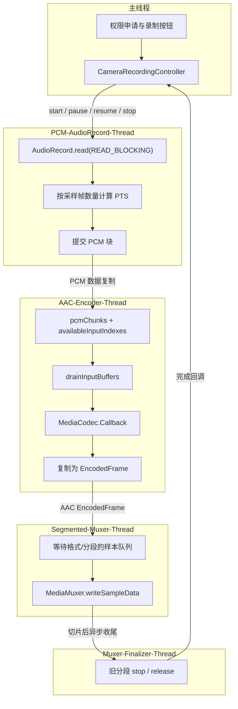
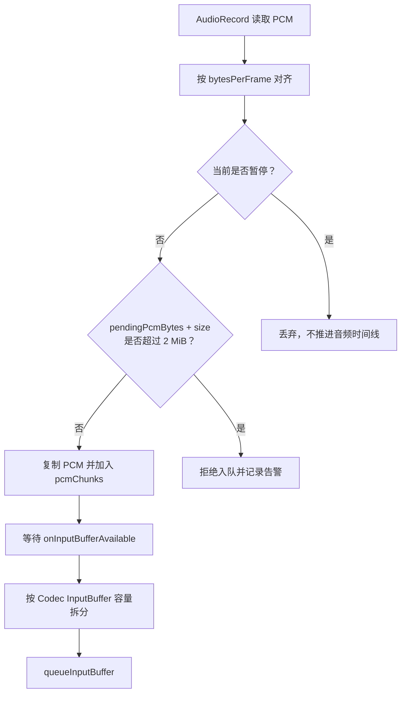
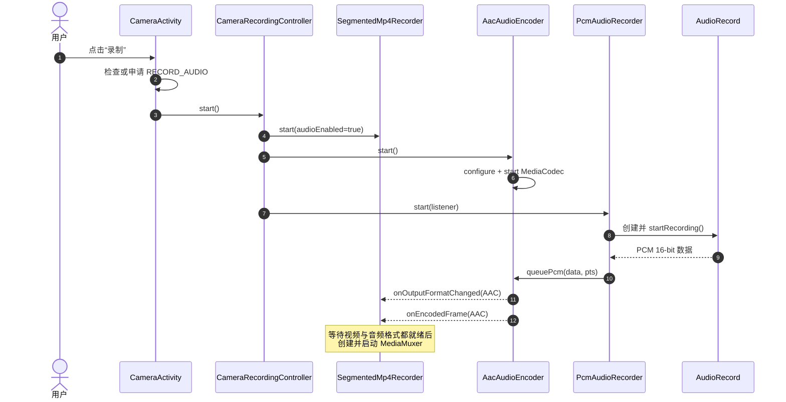
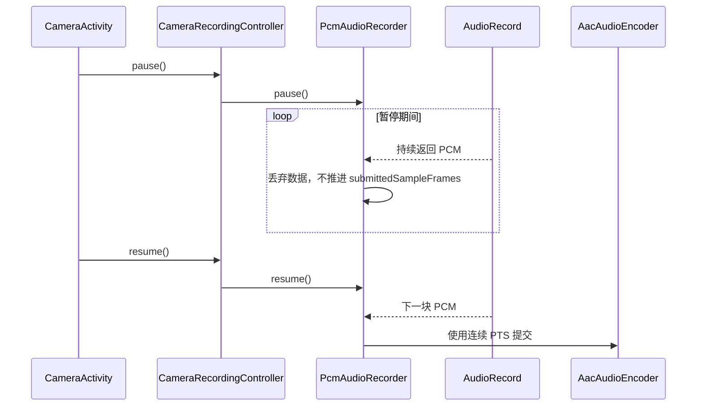
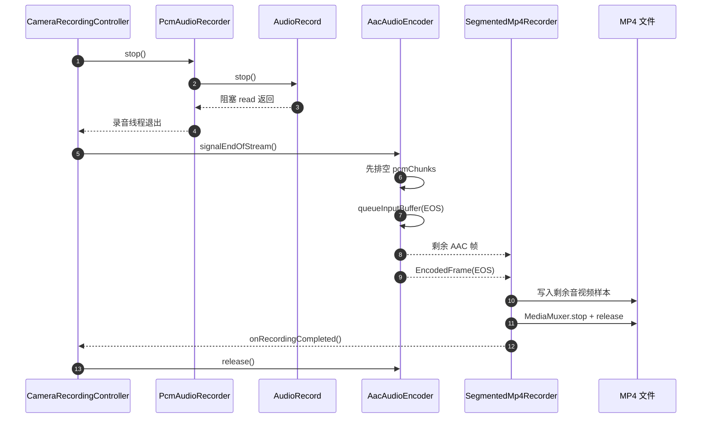
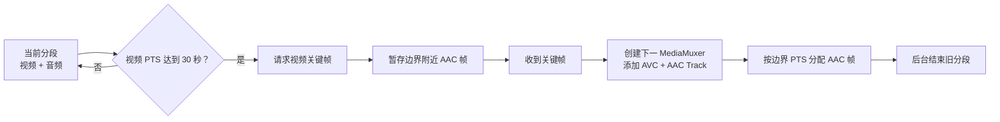
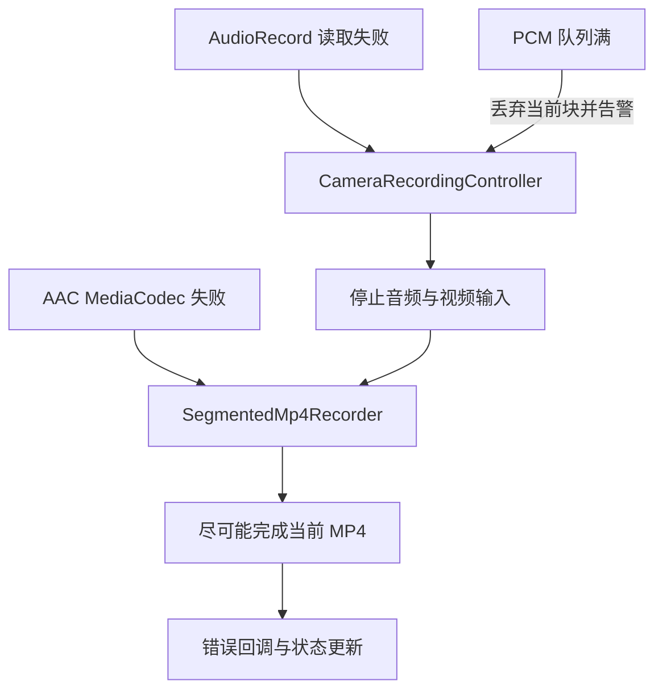

# AAC 录音技术架构设计

本文描述 BestScaffold 当前 AAC 录音链路的设计目标、组件职责、线程与缓冲模型、时间戳策略、暂停恢复、EOS、MP4 分段对齐以及异常处理。

## 1. 设计目标

- 使用 Android `AudioRecord` 采集车机麦克风 PCM 数据。
- 使用 `MediaCodec` 将 PCM 编码为 AAC-LC。
- 将 AAC 与 H.264 视频写入同一个 MP4 分段。
- 录制暂停期间保持麦克风设备占用，但不向 AAC 编码器提交数据。
- 恢复后去除暂停时间间隔，避免生成静音空洞。
- 停止时先排空 PCM 队列，再向 AAC 编码器提交 EOS，保证尾部音频尽量完整。
- 音频采集、AAC 编码和 MP4 写入分别运行在独立线程，避免阻塞 UI、Camera 或 GL 线程。

## 2. 当前参数

| 参数 | 当前值 | 所属配置 |
|---|---:|---|
| 采集源 | `MediaRecorder.AudioSource.MIC` | `PcmAudioRecorderConfig` |
| PCM 编码 | PCM 16-bit little-endian | `PcmAudioRecorder` |
| 采样率 | 48,000 Hz | `AudioEncoderConfig` |
| 声道数 | 1（单声道） | `AudioEncoderConfig` |
| AAC Profile | AAC-LC | `AudioEncoderConfig` |
| AAC 码率 | 128,000 bit/s | `CameraRecordingController` |
| PCM 单次读取缓冲 | 4 KiB | `PcmAudioRecorderConfig` |
| MediaCodec 最大输入缓冲 | 16 KiB | `AudioEncoderConfig` |
| PCM 最大待编码容量 | 2 MiB | `AudioEncoderConfig` |
| MP4 分段时长 | 30 秒 | `SegmentedRecorderConfig` |

## 3. 组件架构

```mermaid
flowchart LR
    Permission["CameraActivity<br/>RECORD_AUDIO 权限"]
    Controller["CameraRecordingController<br/>统一音视频生命周期"]

    subgraph CAPTURE["PCM 采集"]
        Mic["车机麦克风"]
        AudioRecord["Android AudioRecord"]
        Recorder["PcmAudioRecorder<br/>PCM 读取与 PTS"]
        Mic --> AudioRecord --> Recorder
    end

    subgraph ENCODE["AAC 编码"]
        Queue["受容量限制的 PCM 队列"]
        Input["MediaCodec InputBuffer"]
        Codec["AacAudioEncoder<br/>audio/mp4a-latm"]
        Output["EncodedFrame<br/>AAC 数据 / EOS"]
        Queue --> Input --> Codec --> Output
    end

    subgraph MUX["音视频封装"]
        AudioCallback["SegmentedMp4Recorder.audioCallback"]
        VideoCallback["SegmentedMp4Recorder.videoCallback"]
        Segmenter["分段边界与音视频样本路由"]
        Muxer["MediaMuxer"]
        MP4["MP4<br/>avc1 + mp4a"]
        AudioCallback --> Segmenter
        VideoCallback --> Segmenter
        Segmenter --> Muxer --> MP4
    end

    Permission --> Controller
    Controller --> Recorder
    Controller --> Codec
    Recorder -->|"queuePcm(data, pts)"| Queue
    Output --> AudioCallback
    Controller --> Segmenter
```



## 4. 线程与数据所有权



数据所有权规则：

- `PcmAudioRecorder` 在录音线程复用自己的读取缓冲区。
- `AacAudioEncoder.queuePcm()` 在返回前复制有效 PCM 区间，因此录音线程可以立即复用原缓冲区。
- `MediaCodecEncoder` 在释放输出 Buffer 前把 AAC 数据复制到 `EncodedFrame.data`。
- `SegmentedMp4Recorder` 接收到的是独立字节数组，可以异步排队和写入 Muxer。

## 5. PCM 输入与背压



`maxPendingPcmBytes` 用于限制生产速度高于 AAC 编码速度时的内存增长。队列满时当前 PCM 块会被丢弃，后续 PTS 仍按采集时间前进，因此不会让音频整体变慢，但丢弃区间可能形成短暂声音缺口。

## 6. 音频时间戳

音频使用已提交到录制时间线的采样帧数量生成 PTS：

```text
presentationTimeUs = submittedSampleFrames × 1,000,000 / sampleRate
```

以 48 kHz 单声道为例，每个 PCM 采样帧为 2 字节。如果一次提交 4,096 字节：

```text
sampleFrames = 4096 / 2 = 2048
durationUs   = 2048 × 1,000,000 / 48000 ≈ 42,666 us
```

当一个 PCM 块被拆进多个 MediaCodec InputBuffer 时，子块 PTS 为：

```text
chunkPtsUs = blockPtsUs + consumedFrames × 1,000,000 / sampleRate
```

暂停期间 `AudioRecord` 仍然读取麦克风数据，但数据会被直接丢弃，`submittedSampleFrames` 不增加。恢复后的第一块 PCM 会紧接暂停前的 PTS，因此 MP4 中不会出现等同于暂停时长的静音区间。

视频使用 Camera `SurfaceTexture.timestamp` 生成独立的连续 PTS，并在恢复时扣除暂停间隔。音视频都从接近 0 的时间线开始，Muxer 使用各自轨道的单调递增 PTS 对齐播放。

## 7. 启动时序



## 8. 暂停与恢复



暂停时不关闭 `AudioRecord`，原因是重新打开车机音频输入可能存在路由切换、初始化延迟或设备占用问题。持续读取并丢弃数据可以让恢复更稳定，代价是暂停期间麦克风仍被占用。

## 9. 停止与 EOS



停止录音源必须早于 AAC EOS，防止 EOS 之后仍有 PCM 数据进入队列。分段器会等待视频 EOS 和音频 EOS 都到达后再完成最终收尾；若超过控制器的停止超时，则强制停止编码器并结束当前 Muxer。

## 10. 30 秒音视频分段



分段边界由视频关键帧决定：

1. 视频 PTS 达到目标时长后，请求 H.264 关键帧。
2. 等待关键帧期间暂存音频样本。
3. 新关键帧成为下一段的起点。
4. 边界前的 AAC 样本写入旧段，边界后的 AAC 样本写入新段。
5. 旧 Muxer 在 Finalizer 线程执行 `stop/release`，新段继续接收编码数据。

## 11. 状态与异常传播



- `AudioRecord` 不可恢复错误会触发整次录制停止，避免生成只有视频但状态仍显示正常的文件。
- AAC 编码器错误通过 `audioCallback.onError()` 传给分段器，分段器进入错误收尾流程。
- PCM 队列暂时满不会立即终止录制，只丢弃当前块并输出警告。
- UI 生命周期不会停止录音；`App` 持有 `CameraRecordingController`，页面重新出现后重新注册状态监听。

## 12. 资源释放顺序

```text
PcmAudioRecorder.stop
    → AudioRecord.stop
    → 等待 PCM-AudioRecord-Thread 退出
    → AudioRecord.release
    → AacAudioEncoder.signalEndOfStream
    → 等待 AAC EOS
    → MediaMuxer.stop/release
    → AacAudioEncoder.release
```

异常路径仍遵循“先停止 PCM 生产，再停止/释放 AAC 编码器，最后结束 Muxer”的原则。

## 13. 已知边界与扩展方向

- 当前没有显式启用 AEC、NS、AGC 等 `AudioEffect`，录音效果由车机 Audio HAL 和默认音频链路决定。
- 当前固定使用单声道 48 kHz；双声道需要同时修改采集声道掩码、`AudioEncoderConfig.channelCount` 和容量评估。
- 当前暂停期间仍占用麦克风。如果产品要求暂停即释放麦克风，需要增加 AudioRecord 重建与恢复延迟处理。
- 音频与视频使用各自的归一化时钟。长时间录制若发现硬件时钟漂移，可增加基于共同单调时钟的漂移检测与微调策略。
- 当前 PCM 队列满时采用丢帧策略；如果更重视声音完整性，可以改为缩短读取块、提高队列容量或降低 AAC 编码压力。
- 当前未提供静音开关和音频输入源切换，可以在 `CameraRecordingController.start()` 增加音频配置参数。

## 14. 关键源码索引

- [`PcmAudioRecorder.kt`](../codec_core/src/main/java/com/example/codec_core/audio/PcmAudioRecorder.kt)：AudioRecord 采集、暂停恢复、PCM PTS。
- [`AacAudioEncoder.kt`](../codec_core/src/main/java/com/example/codec_core/audio/AacAudioEncoder.kt)：PCM 队列、MediaCodec 输入和 AAC EOS。
- [`EncoderConfig.kt`](../codec_core/src/main/java/com/example/codec_core/config/EncoderConfig.kt)：AAC Profile、采样率、声道、码率与队列容量。
- [`CameraRecordingController.kt`](../app/src/main/java/com/example/bestscaffold/recording/CameraRecordingController.kt)：音视频生命周期与错误编排。
- [`SegmentedMp4Recorder.kt`](../codec_core/src/main/java/com/example/codec_core/muxer/SegmentedMp4Recorder.kt)：AAC Track、边界缓存与音视频分段。
- [`CameraActivity.kt`](../app/src/main/java/com/example/bestscaffold/ui/main/CameraActivity.kt)：录音权限申请和录制入口。
