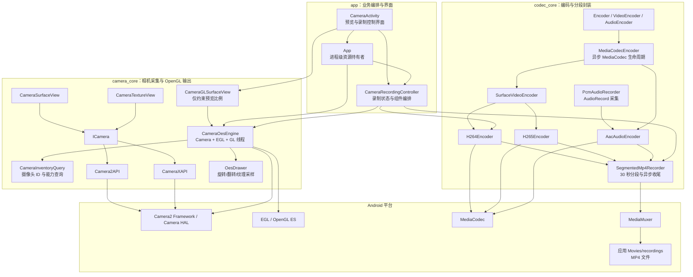
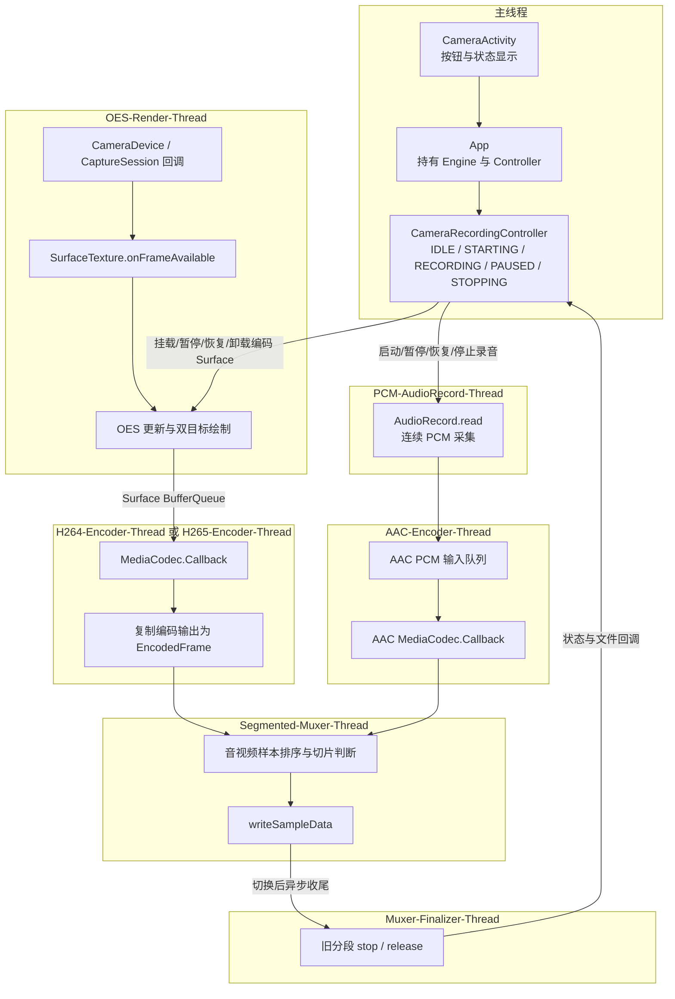
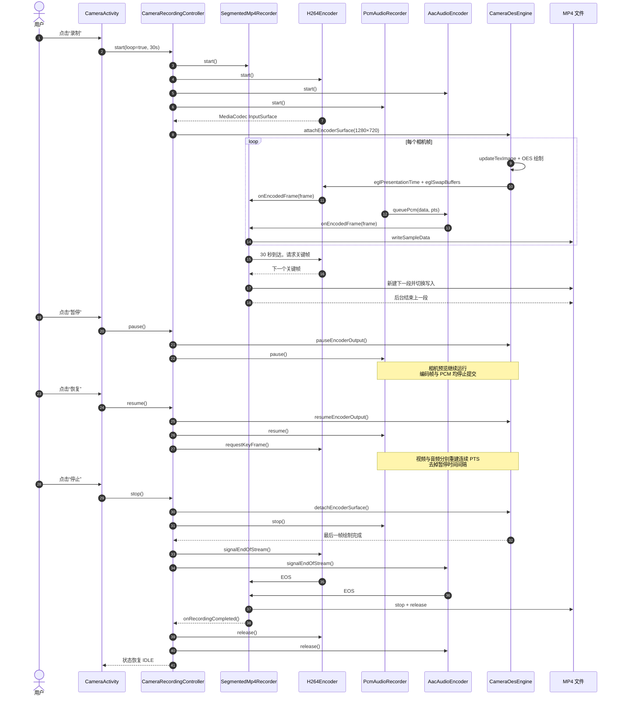
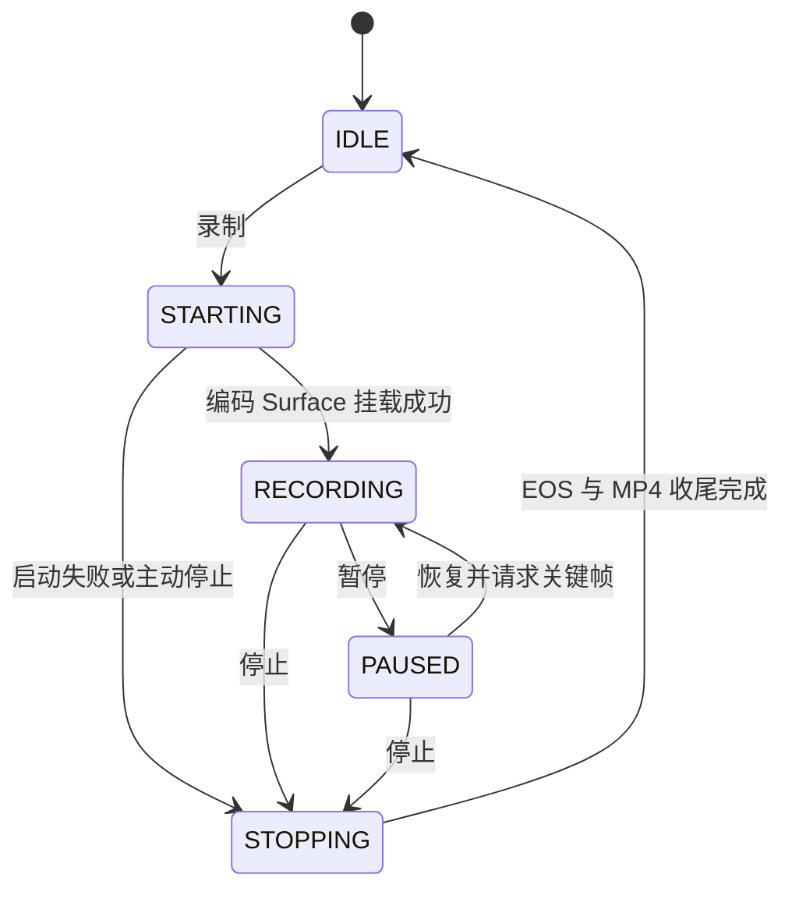

# Camera 与 Codec 架构

本文描述 BestScaffold 当前 `camera_core`、`codec_core` 与 `app` 的模块关系、实际视频录制数据流、线程边界以及录制生命周期。

AAC 录音的缓冲、时间戳、暂停恢复与 EOS 设计详见 [`aac-recording-architecture.md`](aac-recording-architecture.md)。

## 1. 模块总览



当前 App 的录制链路使用 `CameraOesEngine + H264Encoder + PcmAudioRecorder + AacAudioEncoder`。`Camera2API`、`CameraXAPI`、`CameraSurfaceView` 和 `CameraTextureView` 是独立的通用相机 API/控件链路，不参与当前 `CameraActivity` 的录制流程。

## 2. 当前视频数据流

```mermaid
flowchart LR
    Camera["车机摄像头 103"]
    Session["CameraCaptureSession<br/>TEMPLATE_RECORD"]
    InputSurface["Camera 输入 Surface"]
    SurfaceTexture["SurfaceTexture<br/>默认缓冲 1280×720"]
    OES["GL_TEXTURE_EXTERNAL_OES"]
    Update["updateTexImage<br/>取得纹理矩阵与时间戳"]
    Drawer["OesDrawer<br/>纹理坐标旋转与上下翻转"]

    PreviewEGL["Preview EGLSurface"]
    PreviewSwap["eglSwapBuffers"]
    Preview["CameraGLSurfaceView<br/>16:9 预览"]

    EncoderEGL["Encoder EGLSurface<br/>1280×720"]
    PTS["eglPresentationTimeANDROID<br/>连续编码时间戳"]
    EncoderSwap["eglSwapBuffers"]
    CodecSurface["MediaCodec InputSurface"]
    H264["H264Encoder<br/>30 fps / 4 Mbps"]
    VideoCallback["videoCallback<br/>AVC 格式与编码帧"]

    Microphone["车机麦克风"]
    AudioRecord["PcmAudioRecorder<br/>48 kHz / 单声道 / PCM 16-bit"]
    AAC["AacAudioEncoder<br/>AAC-LC / 128 kbps"]
    AudioCallback["audioCallback<br/>AAC 格式与编码帧"]

    Segmented["SegmentedMp4Recorder"]
    MuxerA["当前 MediaMuxer"]
    MuxerB["下一段 MediaMuxer"]
    Files["dvr_时间_序号.mp4"]

    Camera --> Session --> InputSurface --> SurfaceTexture --> OES --> Update --> Drawer

    Drawer --> PreviewEGL --> PreviewSwap --> Preview
    Drawer --> EncoderEGL --> PTS --> EncoderSwap --> CodecSurface --> H264 --> VideoCallback --> Segmented
    Microphone --> AudioRecord --> AAC --> AudioCallback --> Segmented
    Segmented --> MuxerA --> Files
    Segmented -. "达到 30 秒并收到关键帧" .-> MuxerB --> Files
```



这里没有中间 FBO。每个 Camera OES 帧在同一个 GL 线程中直接绘制到两个目标：

- 预览目标：页面可见时挂载，页面销毁只卸载预览 `EGLSurface`，不停止相机采集。
- 编码目标：开始录制时挂载 MediaCodec `InputSurface`，停止录制时先卸载，再向编码器发送 EOS。
- 音频目标：`AudioRecord` 输出 PCM，AAC 编码器通过 ByteBuffer 输入；视频和音频编码帧在同一个分段器中汇合。

## 3. 线程与资源归属



核心线程约束：

- Camera、`SurfaceTexture`、EGLContext、OES 纹理及所有 EGLSurface 都只由 `OES-Render-Thread` 操作。
- `AudioRecord` 的阻塞读取只在 `PCM-AudioRecord-Thread` 执行，按已提交采样数生成连续音频 PTS。
- MediaCodec 的创建、输入/输出回调与释放由各自编码线程负责。
- MediaMuxer 的样本写入在单独的分段线程串行执行，旧分段在 Finalizer 线程收尾，避免阻塞后续编码数据。
- UI 只发出控制命令并观察状态，不直接持有底层 GL 或 MediaCodec 资源。

## 4. 录制与分段时序



## 5. 录制状态机



## 6. Codec 类型关系

```mermaid
classDiagram
    class Encoder {
        <<interface>>
        +state: EncoderState
        +start()
        +signalEndOfStream()
        +stop()
        +release()
    }

    class VideoEncoder {
        <<interface>>
        +inputSurface: Surface
        +requestKeyFrame()
    }

    class AudioEncoder {
        <<interface>>
        +queuePcm(data, presentationTimeUs)
    }

    class MediaCodecEncoder {
        <<abstract>>
        -codecThread: HandlerThread
        -codec: MediaCodec
        +start()
        +signalEndOfStream()
        +stop()
        +release()
    }

    class SurfaceVideoEncoder {
        <<abstract>>
        +inputSurface: Surface
        +requestKeyFrame()
    }

    class H264Encoder
    class H265Encoder
    class AacAudioEncoder
    class PcmAudioRecorder {
        +start(listener)
        +pause()
        +resume()
        +stop()
        +release()
    }
    class SegmentedMp4Recorder {
        +videoCallback: EncoderCallback
        +audioCallback: EncoderCallback
        +setKeyFrameRequester()
        +start()
        +stop()
    }

    Encoder <|-- VideoEncoder
    Encoder <|-- AudioEncoder
    Encoder <|.. MediaCodecEncoder
    MediaCodecEncoder <|-- SurfaceVideoEncoder
    VideoEncoder <|.. SurfaceVideoEncoder
    SurfaceVideoEncoder <|-- H264Encoder
    SurfaceVideoEncoder <|-- H265Encoder
    MediaCodecEncoder <|-- AacAudioEncoder
    AudioEncoder <|.. AacAudioEncoder
    PcmAudioRecorder --> AacAudioEncoder: queuePcm
    H264Encoder --> SegmentedMp4Recorder: videoCallback
    H265Encoder --> SegmentedMp4Recorder: videoCallback
    AacAudioEncoder -.-> SegmentedMp4Recorder: audioCallback
```

## 7. 当前边界与扩展点

- 当前 App 默认使用 H.264 Surface 输入编码；H.265 已实现，可在设备能力检测通过后替换。
- 当前 App 已接入 `AudioRecord`，使用 48 kHz 单声道 PCM 和 AAC-LC 128 kbps 编码，MP4 同时包含视频轨与音频轨。
- `SegmentedMp4Recorder` 默认开启循环分段，每段 30 秒；这里的“循环”表示持续生成新分段，目前尚未实现按容量或文件数量自动删除最旧文件。
- 预览与录制使用同一个 `OesDrawer`，因此旋转、上下翻转等纹理坐标处理会同时作用于预览和编码成片。
- 如果后续增加多级滤镜、水印合成或要求输出普通 `GL_TEXTURE_2D`，可以在 OES 与两个输出目标之间增加可选 FBO 处理节点；仅旋转/翻转时保持当前直绘路径性能更高。

## 8. 关键源码索引

- [`CameraOesEngine.kt`](../camera_core/src/main/java/com/example/camera_core/view/CameraOesEngine.kt)：相机、GL 线程、预览与编码 Surface 输出。
- [`OesDrawer.kt`](../camera_core/src/main/java/com/example/camera_core/opengl/OesDrawer.kt)：OES 纹理采样和方向处理。
- [`CameraRecordingController.kt`](../app/src/main/java/com/example/bestscaffold/recording/CameraRecordingController.kt)：录制生命周期编排。
- [`MediaCodecEncoder.kt`](../codec_core/src/main/java/com/example/codec_core/internal/MediaCodecEncoder.kt)：MediaCodec 公共生命周期。
- [`SurfaceVideoEncoder.kt`](../codec_core/src/main/java/com/example/codec_core/video/SurfaceVideoEncoder.kt)：视频 Surface 输入实现。
- [`PcmAudioRecorder.kt`](../codec_core/src/main/java/com/example/codec_core/audio/PcmAudioRecorder.kt)：麦克风 PCM 采集、暂停恢复和音频 PTS。
- [`AacAudioEncoder.kt`](../codec_core/src/main/java/com/example/codec_core/audio/AacAudioEncoder.kt)：AAC-LC ByteBuffer 输入编码。
- [`SegmentedMp4Recorder.kt`](../codec_core/src/main/java/com/example/codec_core/muxer/SegmentedMp4Recorder.kt)：关键帧切片和多 Muxer 收尾。
